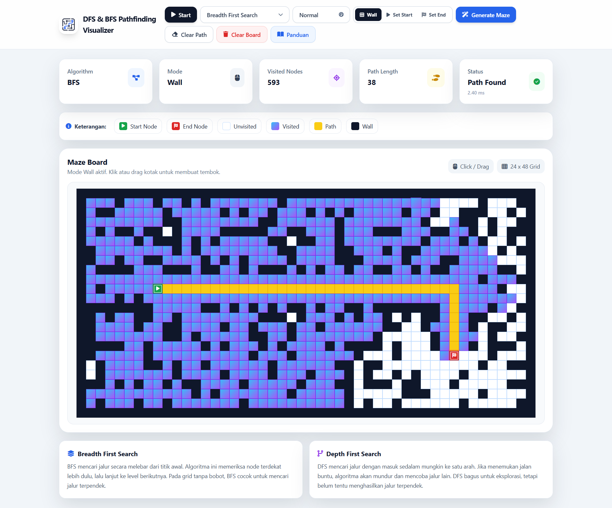
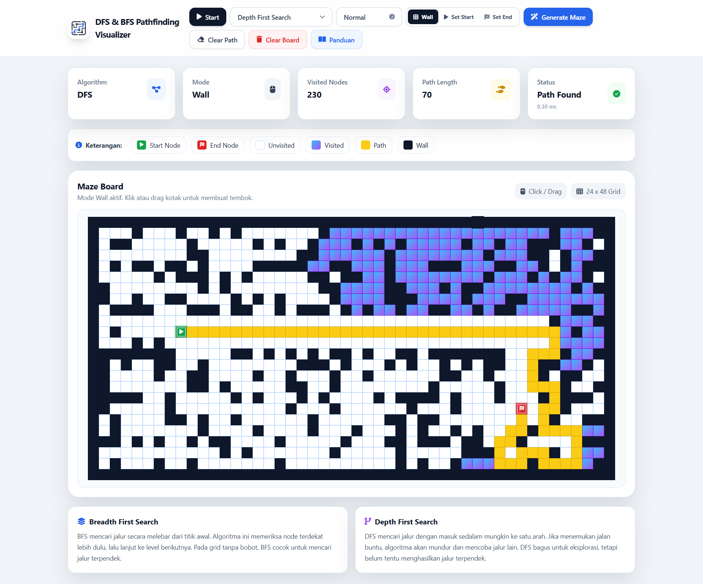

<p align="center">
  
</p>

<h1 align="center">PathFinder Maze Visualizer</h1>

<p align="center">
  Aplikasi web interaktif untuk memvisualisasikan pencarian jalur menggunakan algoritma
  <b>Breadth First Search</b> dan <b>Depth First Search</b>.
</p>

<p align="center">
  <a href="https://pathfindermazevisualizer.netlify.app/">
    <b>Live Demo</b>
  </a>
  ·
  <a href="https://github.com/Niel-D22/DFS-BFS-pathfinding-visualizer">
    <b>Repository</b>
  </a>
</p>

---

## Tentang Project

**PathFinder Maze Visualizer** adalah aplikasi berbasis web yang digunakan untuk memvisualisasikan proses pencarian jalur dari titik awal menuju titik tujuan pada sebuah grid.

Project ini menerapkan dua algoritma pencarian, yaitu **Breadth First Search** dan **Depth First Search**. Pengguna dapat membuat rintangan, memindahkan titik awal dan titik tujuan, memilih algoritma, mengatur kecepatan animasi, lalu melihat proses pencarian jalur secara visual.

---

## Live Demo

Aplikasi dapat diakses secara online melalui link berikut:

https://pathfindermazevisualizer.netlify.app/

---

## Tampilan Aplikasi

### Visualisasi Breadth First Search

<p align="center">
  
</p>

<p align="center">
  <b>Hasil visualisasi pencarian jalur menggunakan Breadth First Search</b>
</p>

**Breadth First Search** menampilkan proses pencarian yang menyebar dari titik awal menuju titik tujuan. Algoritma ini memeriksa node yang paling dekat terlebih dahulu sebelum melanjutkan ke node berikutnya.

---

### Visualisasi Depth First Search

<p align="center">
  
</p>

<p align="center">
  <b>Hasil visualisasi pencarian jalur menggunakan Depth First Search</b>
</p>

**Depth First Search** menampilkan proses pencarian yang menelusuri satu jalur lebih dalam terlebih dahulu. Jika jalur tersebut tidak menemukan tujuan, algoritma akan kembali dan mencoba jalur lain.

---

## Fitur Utama

- Memilih algoritma **Breadth First Search** atau **Depth First Search**
- Menjalankan visualisasi pencarian jalur pada grid
- Membuat wall atau rintangan secara manual
- Memindahkan start node dan end node
- Mengatur kecepatan animasi
- Membuat maze secara otomatis
- Menghapus hasil pencarian tanpa menghapus wall
- Menghapus seluruh board
- Menampilkan jumlah visited node
- Menampilkan path length
- Menampilkan status dan waktu proses
- Menyediakan halaman panduan penggunaan aplikasi

---

## Algoritma yang Digunakan

### Breadth First Search

**Breadth First Search** adalah algoritma pencarian yang bekerja dengan cara melebar dari titik awal. Algoritma ini memeriksa node yang paling dekat terlebih dahulu, lalu lanjut ke node pada level berikutnya.

Pada grid tanpa bobot, **Breadth First Search** cocok digunakan untuk mencari jalur terpendek.

### Depth First Search

**Depth First Search** adalah algoritma pencarian yang bekerja dengan cara menelusuri satu jalur sedalam mungkin terlebih dahulu. Jika jalur tersebut tidak menemukan tujuan, algoritma akan kembali ke percabangan sebelumnya dan mencoba jalur lain.

**Depth First Search** dapat menemukan jalur, tetapi jalur yang ditemukan belum tentu merupakan jalur terpendek.

---

## Teknologi yang Digunakan

| Teknologi | Fungsi |
|---|---|
| HTML | Membuat struktur halaman web |
| Tailwind CSS CDN | Membuat tampilan antarmuka |
| JavaScript | Mengatur logika aplikasi dan algoritma |
| Font Awesome | Menampilkan ikon pada antarmuka |
| Netlify | Melakukan deploy aplikasi |

---

## Struktur Folder

```text
DFS-BFS-pathfinding-visualizer/
├── algorithms/
│   ├── bfs.js
│   └── dfs.js
├── asset/
│   ├── BFS.png
│   ├── DFS.png
│   ├── Logo.png
│   └── LogoHeader.png
├── index.html
├── panduan.html
├── script.js
└── README.md
